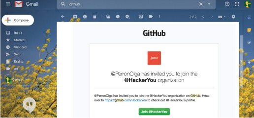
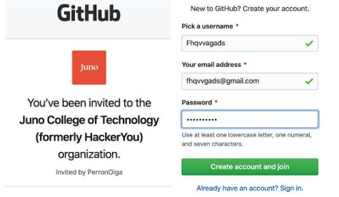

# GitHub

This is where you will access your course notes. To access your specific course notes, please view these instructions:

- You’ll receive an email invite from GitHub that will prompt you to sign up. Please note: the invites sometimes appear as junk mail, please check your spam folder for the emails.

- Click “Join @ HackerYou” and either sign-in with your existing account or create a new account.

- Once you accept the invitation and are logged in, you will see the course notes on the homepage: https://github.com/HackerYou. The direct link to the course notes will also be pinned in your course slack channel. 

Please Note: If you are a returning Juno student, and have provided your GitHub username in the pre-course form before class begins, you will be added by your username and will not receive a new email invitation. When you login to your GitHub account, you will see the new repo.

Below you can find the links to the course notes for your program. You will have access to the notes before your course begins (please see your Welcome Email for more details on when you will be granted GitHub access). You must be logged in to access the notes. 

Part-time Courses
- [Data Analytics](https://github.com/HackerYou/con-ed-data-foundations)
- [Web Development](https://github.com/HackerYou/con-ed-web-dev)
- [JavaScript](https://github.com/HackerYou/con-ed-javascript)
- [UX](https://github.com/HackerYou/con-ed-ux)

Bootcamp Courses
- [Web Development Bootcamp](https://github.com/HackerYou/bootcamp-notes)
- [Data Analytics Bootcamp](https://github.com/HackerYou/data-bootcamp-notes)

You will continue to have access to the GitHub notes even after the course finishes. If you have any difficulties accessing the notes, please contact Laura Easson via [Slack](https://junocollege.slack.com/team/U01JN7E8ELE) or [email](mailto:laura.easson@junocollege.com).
