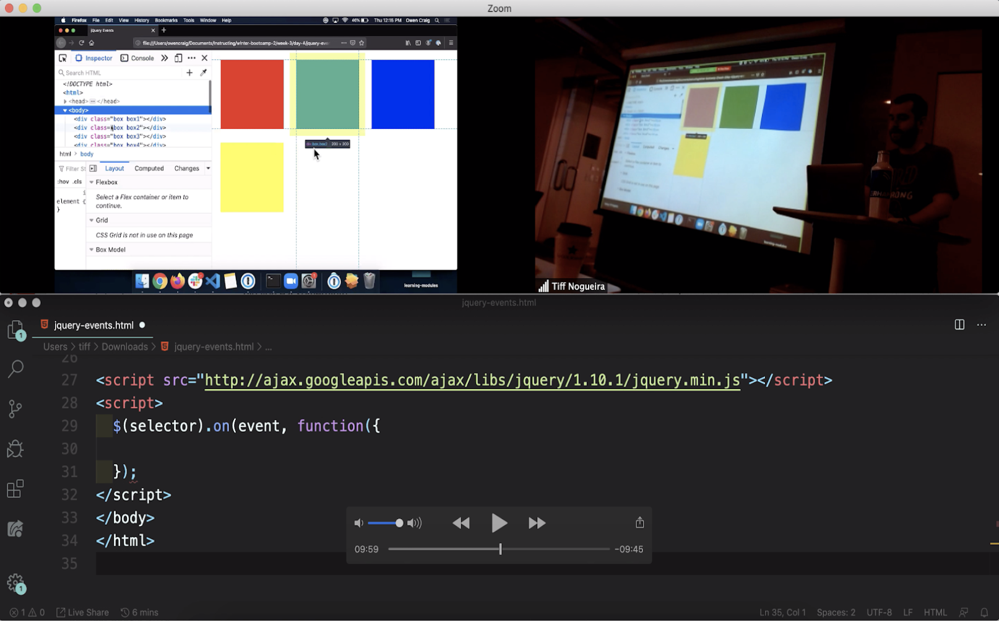
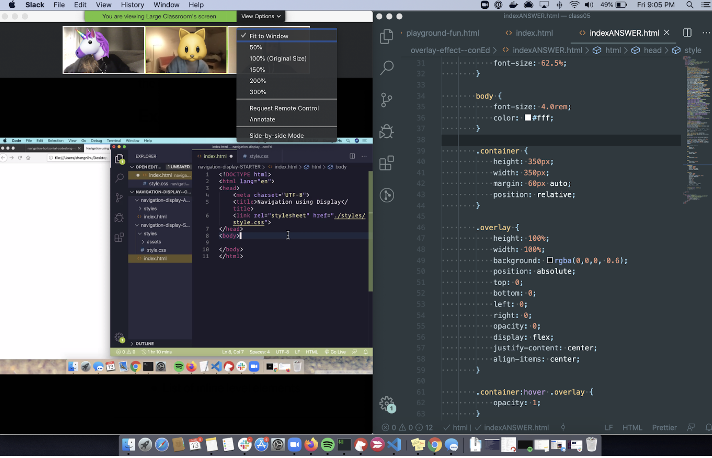

# Setup Guide for Live Online Web Development Bootcamp

## Before Class Starts

Congratulations on your acceptance to Bootcamp! We’re looking forward to getting started!  

Please read through this guide carefully before your first day and complete all steps.

This guide covers:
1. Zoom 
2. VS Code Terminal and Live Share Extension
3. Slack
4. GitHub
5. Participating & Getting Help 

## Zoom

### Zoom Set Up
- Create a free account using the same email address you used to sign up for your Juno course
- Test your microphone and webcam with Zoom
- Zoom now allows you to add your pronouns. Refer to [this guide](https://support.zoom.us/hc/en-us/articles/4402698027533) to set this up 
- View the [Zoom Overview](https://support.zoom.us/hc/en-us/articles/201362193-Joining-a-Meeting) to get familiar with Zoom on your machine

### Suggested Environment Setup for Lessons
- Use “Speaker View” in zoom for the best experience
- If you have access to an additional monitor, use it! There is also a zoom app, so your phone or tablet could become an additional screen
- If you do not have access to an additional monitor, we recommend you set up the Zoom window so it takes up the half of your screen and you can view the notes and your text editor on the other half of your screen

For example, here’s a set up with the zoom window on the top half of your screen:

 
And here’s an example with your zoom screen on the left side of your screen:

 

## VS Code Terminal & Live Share Extension

 
### VS Code Terminal

To open the terminal on Macs:
- Use the ⌃` keyboard shortcut with the backtick character.
- Use the View > Terminal menu command.
- From the Command Palette (⇧⌘P), use the View: Toggle Integrated Terminal command.
 

To open the terminal on Windows:
- Use the Ctrl+` keyboard shortcut with the backtick character.
- Use the View > Terminal menu command.
- From the Command Palette (Ctrl+Shift+P), use the View: Toggle Integrated Terminal command.

Detailed explanation and examples:
[Integrated Terminal](https://code.visualstudio.com/docs/editor/integrated-terminal)

### VS Code Live Share
- Follow [this guide](https://www.digitalocean.com/community/tutorials/how-to-use-live-share-with-visual-studio-code) to download the Live Share extension

## Slack
To learn all about Slack setup, please see the [Slack](./Slack.md) guide in this repository. 
   

## GitHub
To learn all about GitHub setup, please see the [GitHub](./GitHub.md) guide in this repository.
   

## Participating and Getting Help

### Asking Questions During Project Work Time
- Ask your questions via HelpCue. Your class HelpCue code will be shared during class.
  - Ask clear, detailed questions about the problem you’re having
  - Include info about what you’ve already tried to solve the problem
  - Add your name and include your Slack @ to make sure your instructors message the right person!
- Here’s an example question: "Hi it’s ________. I am having trouble with _____. My slack username is ______. I've tried _______ and _____.”
- An instructor will DM you via Slack and troubleshoot your problem
- Please ensure you’re paying attention to Slack when you add questions to HelpCue. The instructor will wait for 5 minutes for a response before moving on to the next question in the queue.

### Asking Questions After Class Hours
- The #helpme Slack channel in the Juno College Workspace is available to you any time!
- Evening and weekend Alumni Office Hours are scheduled throughout your Bootcamp. The timing of these sessions will be added to your Bootcamp Student calendar and are noted in your Important Dates document.
- 1:1 Mentorship can always be arranged if you want support with revisiting concepts! Please Laura Easson (the Student Experience Specialist) via [Slack](https://junocollege.slack.com/team/U01JN7E8ELE) to schedule time with an alumni mentor.

### Huddles
You’ll be added to a Slack channel in the Juno Bootcamp Workspace with your Huddle Group classmates the first week of classes.
- Information on what these are and how they work will be shared during your first couple weeks of class!
- After the first week: Mondays at 10am ET, you’ll video chat with your Huddle Group via Slack

### Tests & Exam
- Tests and the exam will be held at 10am ET (unless otherwise noted)
- The test link will be shared in the Zoom classroom at 10am ET sharp and removed once the test begins
- Missing the test link means you’ll receive a 0 on the test or exam
- You will have 15 minutes to complete tests (10 multiple choice questions) and 40 minutes to complete the exam (25 multiple choice questions)

### Project Presentations
- Your instructor will host presentations and announce the order in which you’ll present
- Each student (or group) will share their screen to showcase their projects and identify:
  - How their project functions
  - One technical win
  - One technical challenge

### Collaborative Projects 

#### Project 2 - Paired
- You will learn about Git collaboration which will address how to contribute to a shared repo, how to avoid merge conflicts, and how to solve conflicts when they arise
- You will be encouraged to use VS Code’s Live Share to paired program with your project partner
- Pairs should use Zoom or Slack to video chat and screen share as well as using Live Share

#### Project 4 - Group
- You will learn about and complete a project management roadmap before beginning work on your project
- Groups should use Zoom or Slack to video chat and screen share to collaborate
