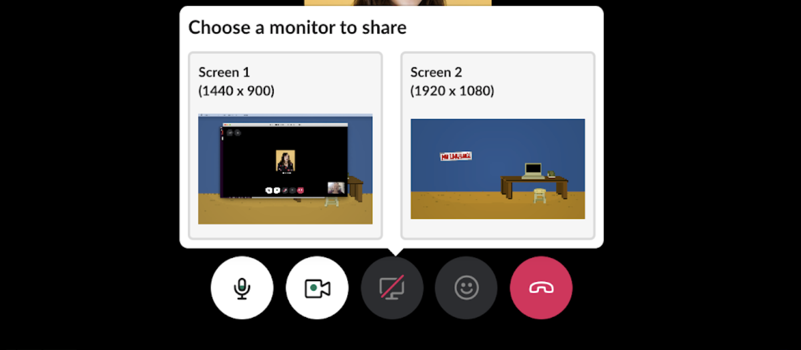

# Slack

## What is Slack used for?
All our classes use Slack for the main communication in the classroom. While we teach classes on Zoom, we use Slack channels to discuss topics, ask questions, and be engaged in the classroom. 

## How to Download Slack on your computer
Download Slack Desktop App ([Mac](https://slack.com/intl/en-ca/downloads/mac?geocode=en-ca), [Windows](https://slack.com/intl/en-ca/downloads/windows)). Once you follow the instructions in those links, please make an account and complete your Slack profile.

## Can I use the web app or do I have to use the desktop version?
The desktop version of Slack provides access to more features, so please ensure you have downloaded the desktop version before your course begins. 

## Accepting a Slack invite
Once you've joined a class, you will be sent a Slack invite to the email you provided closer to the start of class. Please refer to the Welcome Email you receive for the approximate date you'll be added for your class. Once received, click the email invite and you'll be added to the class channel. See below on how to access your class channel on Slack. 
NOTE: If you have already been a part of a course at Juno previously, you will be added to Slack via your previous account. 

### Bootcamp Workspace VS Juno College Workspace (Bootcamps only)
For Bootcamp courses, you will receive a separate invite for the Juno Bootcamp Workspace. When you receive the invite, you will have to add this workspace to your previous Juno College Slack account. We recommend connecting your previous account, as you will still be using the Juno College Workspace during Bootcamp courses. 
   
NOTE: Once your receive your invite to the Juno Bootcamp Workspace, follow these steps if you're having trouble accessing the workspace:
1. Click on the link in the Email Invite you receive from Slack (might be in your junk email)
2. A Slack webpage will open and it will prompt you to create a new account. If you click through this menu, you should see an option to sign into your account already 
   - *NOTE* you may have to create a new account but make sure you use the same email address as what you used with your Juno College Worskpace account (where part-time courses were) so you can connect your accounts
4. Once you've added the workspace via this webpage, you should be able to see the workspace in your Slack App. If you still do not see it:
   - Once signed into the Slack App, click the "+" sign below your workspaces and select "Sign in to another workspace"
   - Follow the prompts and you should see the workspace appear in the app! 
 
NOTE: you will have to create a new profile on this workspace, even though your accounts are connected. Don't be alarmed if your profile picture and names have to be added again.

## How to create a Slack profile 
Use this guide to [Edit your Profile](https://slack.com/intl/en-ca/help/articles/204092246-Edit-your-profile) or follow along with these simple step by step instructions:

- Click your profile picture in the top right corner and select “Edit Profile”.
- Please add your first and last name to the “Full Name” field - ensure this matches your full name
- Your “Display Name” will be the name used for your slack handle - please don’t be too creative here. I suggest using your first and last name.
- Click on “Upload an Image” to add your lovely face to Slack.
- Please ensure your time zone is correct.
- Add your pronouns to the “Pronouns” field.
- In “Bio” add a short About You statement. 
- Click “Save Changes” and marvel at your complete profile!

## How to access class channels on Slack
Before your class begins, you will be added to your class channel. 
1. On the leftside bar (add screenshot), you should see your course there.
2. Most of the time, it will have this naming convention: 
- year-season#-course (for part-time and acclerated courses)
- cohort#-bootcamp (for bootcamp)

If you don't see the the course on the leftside bar, here's how you can search for it:
- Find the Search Bar, which is typically located at the top of the Slack for Desktop app
- Search for your classroom name (i.e. React) and it should appear in the list below the Search Bar

If you do not see your classroom channel listed, please contact Laura Easson via Slack or email.

## Video Calling on Slack 
Slack works better as a downloaded program versus on the web app. You will need to have the desktop app in order to use full functionality, including making Slack video calls.

To make a call:
1. Type /call or press the phone icon at the top right of a direct message conversation or channel. This will send a call request to everyone in the direct message conversation or channel.
2. When the call connects, you will have a few options at the bottom of the screen.
- Turn your camera by pressing the camera icon at the bottom. 
- Mute or unmute yourself using the microphone icon at the bottom. 
- The computer screen icon will let you share your screen and select which desktop you would like to share.  
- The smiley face icon lets you use emojis. You can add emojis by selecting the keyboard on the right hand side of the emojis
- Hang up by pressing the red phone icon, or closing the window. 

## Slack Huddles (for Bootcamps only)
Slack now has a feature where you can enter a one-on-one voice conversation with someone! You can use this Huddle feature by doing the following:
1. Click on the person in Slack you'd like to enter a Huddle with. You have to be in the messaging area, where you would send a DM to the person, in order to see the Huddle feature
2. On the bottom left corner, there is an antenna with the person's name and a little headphone's icon. Switch that antenna on!
3. You've entered the Huddle! The person will be notified that you have started a Huddle with them and will join
4. Voila! You can now talk to the person one-on-one

Huddles are a great way to communicate with individuals quickly via voice chat. It works very similarly to call, but quicker and with no video. Try one today!

## The Slack Basics
### Slack Etiquette
Please make sure you are being respectful of everyone in your Slack channels. At Juno, we value inclusion and respect, and so we want to make sure everyone is practicing these values as they communicate in channels. This includes using inclusive language and making sure you are using the correct pronouns for people. 
- don't use @here or @channel in public channels
- there will be a gentle reminder in the form of Slackbot anytime gender-specific language is used (i.e. you guys, ladies and gentleman, etc.). This is only to remind you to please use inclusive gender-neutral language (such as pals, friends, cohortmates, etc.)

### How to View Pinned Messages
1. Hover over the message you'd like to pin in the channel until the bar of commands shows
2. Click the "...(More Actions)" 
3. You should see an option entitled "Pin to Channel". Click on that and the message will show as a pinned message in the channel
 
### Bookmarks
In certain classes, you may see a Bookmarks Bar at the top. This includes important links to use throughout the duration of class. 

### How to have calls on Slack
Here is an overview on how to [Make Calls in Slack](https://slack.com/intl/en-ca/help/articles/216771908-Make-calls-in-Slack). Please note, you'll only be able to video call 1:1 and screen sharing is unavailable, unless you are currently in Bootcamp. 

### Slack Community Channels
Once you are added to the Juno College Community Slack, you will automatically be added to the following channels:
- helpme: this is where you can ask any general questions about the code you're working with
- random: a.k.a. our party room! Casual chit-chats and general fun go here!
- announcements: where important announcements related to the entire Juno Community go
