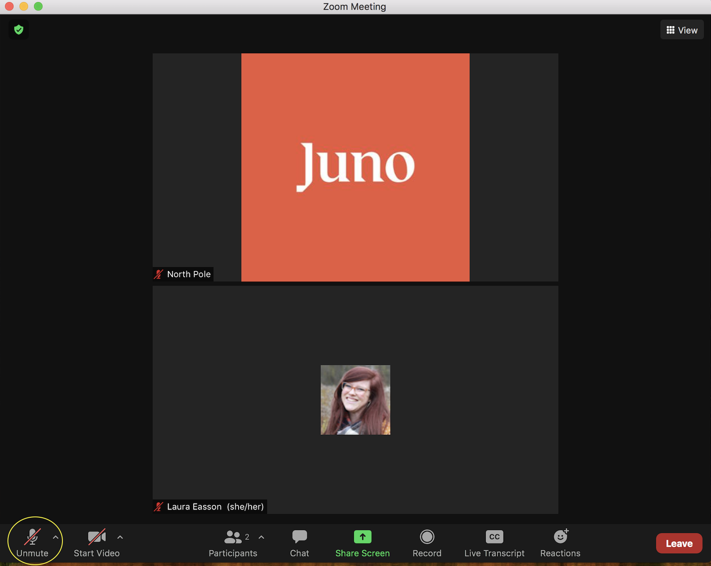
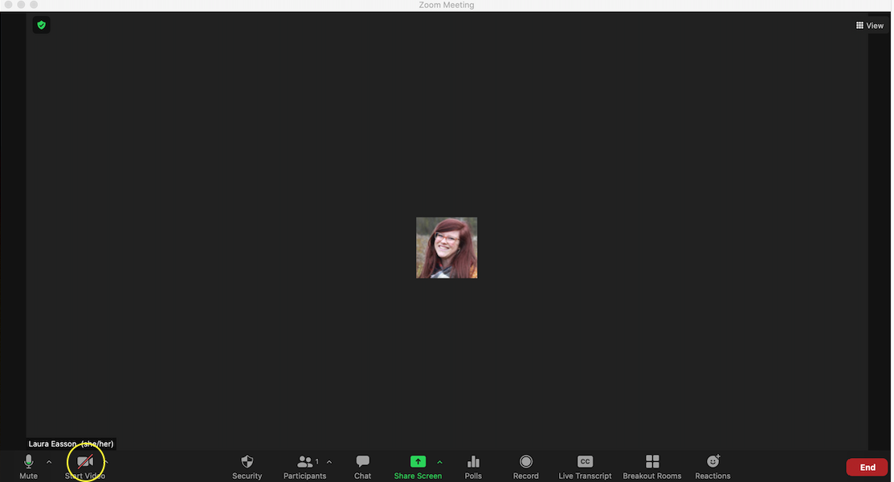
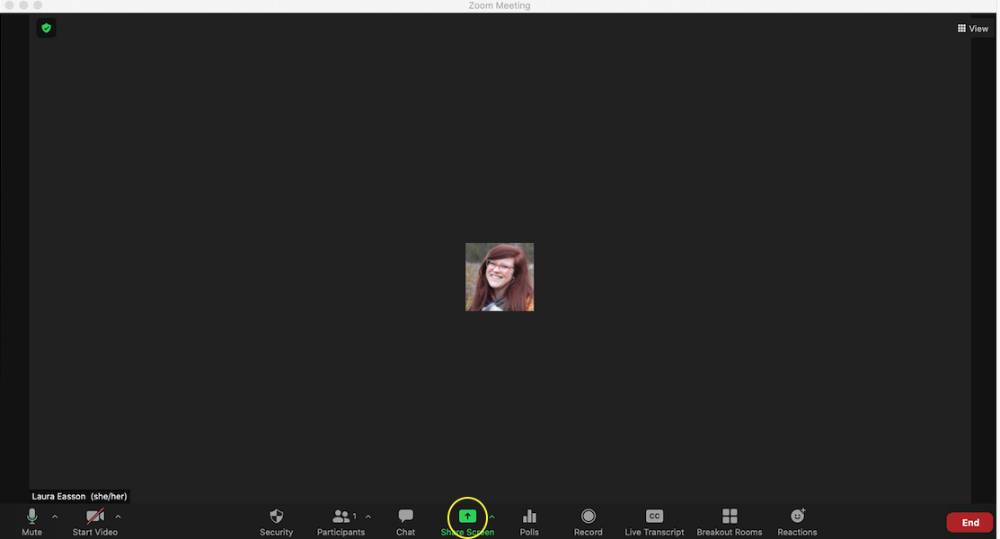
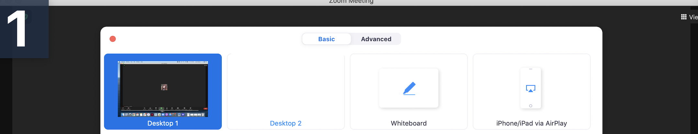

# Zoom

## What is Zoom Used For?
Zoom is where we host all of our virtual classes. While we use Slack to communicate (see [Slack](/Slack.md) for more information), we use Zoom as the virtual classroom to teach our materials. Once signed up for a course, you will be given a Zoom link in your Welcome Email to access the Zoom classroom. This link will be active right at the start of a course until its end. The link will also be posted in the Slack Classroom Channel. 

## How to Download Zoom
To download Zoom, use this [link](https://zoom.us/download?zcid=1231) and follow the instructions on their webpage. NOTE: if you already have Zoom installed on your computer, please ensure you have version 5.0 or higher.

## The Zoom Basics

### Display Name
Once you enter a Zoom Room for the first time, you will be prompted to add your name. Please make sure that your name on Zoom should reflect the name you put on the pre-course form or the name you registered with. If you have a preferred name, you can use this as well. For more information on how to update your name and your profile information, please refer to this guide entitled [Customizing your profile](https://support.zoom.us/hc/en-us/articles/201363203-Customizing-your-profile).

### How to Add Pronouns
To see how to add your pronouns to your Zoom profile, please refer to [this guide](https://support.zoom.us/hc/en-us/articles/4402698027533). 

### Break-out Rooms
From time to time, instructors may put you into break-out rooms where you'll be able to collaborate in small groups, discuss project ideas or do in-class exercises with your classmates. The instructor will automatically asssign you to a break-out room, so all you need to do is click the accept button when the pop-up appears on your screen.  

### Zoom Etiquette at Juno 
During classes in the Zoom Classroom, we ask you to do the following:
1. Please do not use the Zoom chat for course-related questions or topics. Questions should be posted in the course slack channel.
2. If you can, please leave your video on for the duration of class. This really helps our instructors and mentors know if students are understanding the material, and helps you connect better with your classmates. If you are not able to keep your camera on, please actively participate in the course slack channel, asking questions and engaging with your classmates and instructor.

### Zoom Tools

Here are some helpful screenshots in order to find the various settings on the Zoom meeting screen:
#### Mute/unmute

#### Video on/off

- Hide Self-View (coming soon)
- Closed Captioning (coming soon)
#### Leaving Computer Audio
1. Click the "Share Screen" button

     

2. You'll come to the basic sharing options, where you can choose to share your screen (which may be needed from time to time)

     

3. Click on "Advanced" and click Computer Audio and you'll be able to just share your computer audio with the class. 

   
