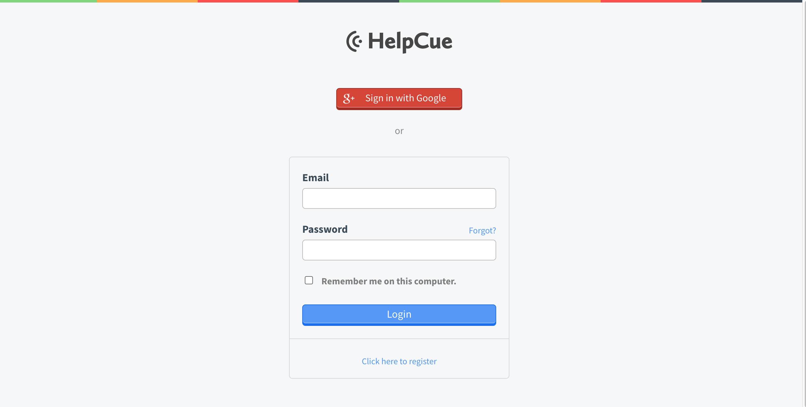
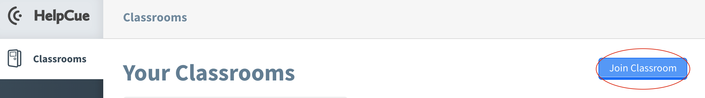
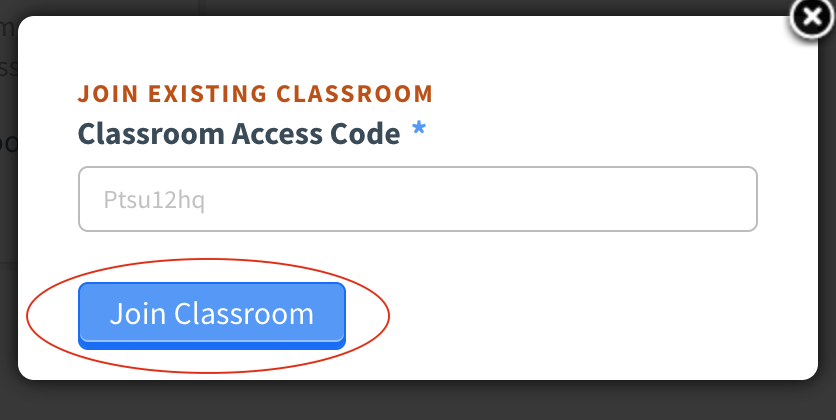
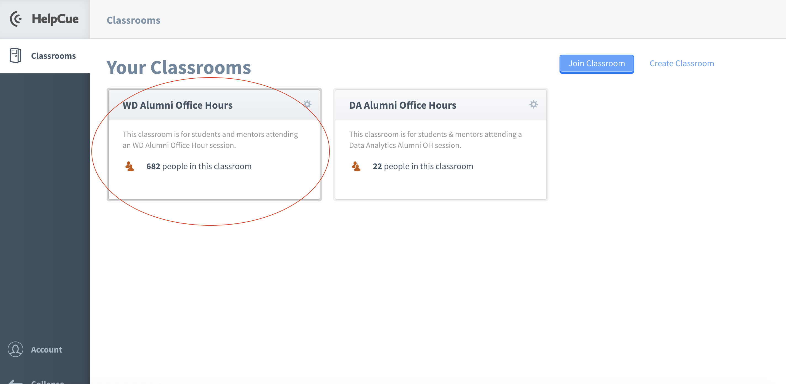
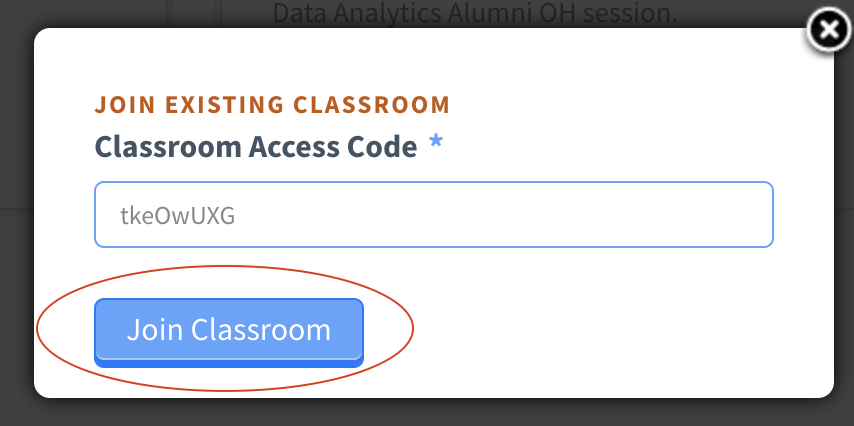
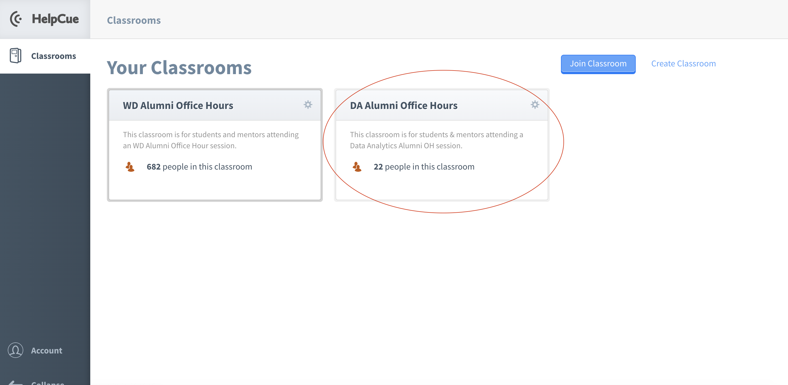
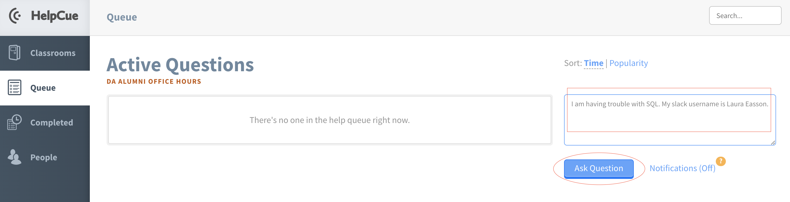

# Alumni Office Hours

### What are Alumni Office Hours?
Alumni Office Hours are alumni-run help sessions for current students. If you need any project work help or need some additional help figuring out a concept, this is the session for you! A group of alumni mentors will be assigned to each Alumni Office Hour session, and, using HelpCue, you will be able to ask for assistance from one of our amazing alumni! Refer to your Welcome Email and class Slack Channel for your specific dates and times for these sessions.

### When are they?
Alumni Office Hours occur on Wednesdays/Thursdays from 6:00pm - 8:00pm ET or Saturdays/Sundays from 1:00pm - 4:00pm ET. You will get reminders in your Slack Course Channel for the Alumni Office Hours that do not conflict with your program.

### How do these sessions run?
You'll be using HelpCue and Slack! To ask questions, you'll join our Alumni Office Hours HelpCue Classroom. Here are some further instructions on how to participate <b>(NOTE: There are separate instructions for Web Development and Data Analytics)</b>:

### Web Development Alumni Office Hours
- Log into [HelpCue](https://www.helpcue.com/) 

  
- Add the Alumni Office Hours classroom - our room code is Ptsu12hq

 

 

 

- Submit your question to HelpCue & Include your @SlackName
  - You can use the following question format: "I am having trouble with ______. My slack username is ______."  

 

- One of our awesome alumni will reach out to you via Slack and help resolve your misbehaving code or review concepts! Our alumni will be on HelpCue on the designated dates and times waiting for your questions to help you out individually. 

   
### Data Analytics Alumni Office Hours
- Log into [HelpCue](https://www.helpcue.com/) 

  
- Add the Alumni Office Hours classroom - our room code is tkeOwUXG

 

 

 

- Submit your question to HelpCue & Include your @SlackName
  - You can use the following question format: "I am having trouble with ______. My slack username is ______."  

 

- One of our awesome alumni will reach out to you via Slack and help you with your projects or review concepts! Our alumni will be on HelpCue on the designated dates and times waiting for your questions to help you out individually. 
