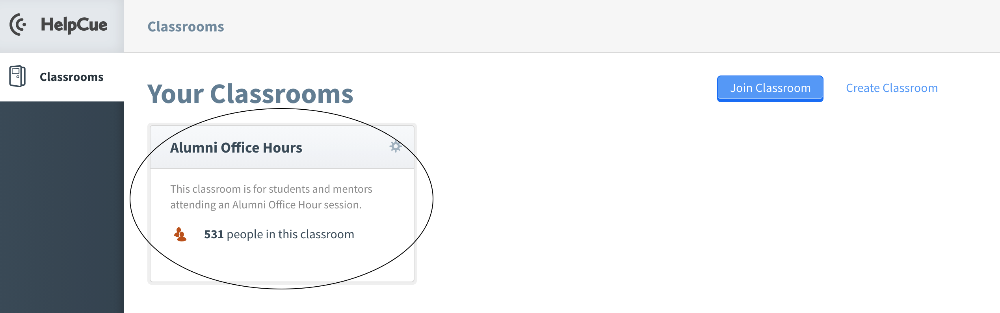

# Part-Time JavaScript

- [Course Link](#course-link)
- [Programs to Download](#programs-to-download)
- [Where to Ask for Help](#where-to-ask-for-help)
- [Alumni Office Hours](#alumni-office-hours)

## Course Link
These are the links to important documents for our current and upcoming courses. You will gain access to these notes before your first class. Please refer to your Welcome Email for the exact date of access.

- [JavaScript](https://github.com/HackerYou/con-ed-javascript)
- [Student Resources](https://github.com/HackerYou/student-resources)

## Programs to Download

These are the specific programs needed to download:

- [Firefox](https://www.mozilla.org/en-CA/firefox/new/)
- [Visual Studio Code](https://code.visualstudio.com/download)

Please review the Set-Up For Success section of [Student Resources](https://github.com/HackerYou/student-resources) to ensure you have Zoom and Slack downloaded. Please also make sure that you have completed the Pre-Course Form for your program. The Pre-Course Form for your specific course is shared in your Welcome Email.

## Where to Ask for Help
There are many ways to ask for help after class hours: 
1. You can use the Slack Channel **#helpme** and you'll be able to ask your question to many alumni of our programs
2. Use the **classroom channel** for your course to ask a question and perhaps a classmate or two will be able to help you!
3. **Alumni Office Hours** occur on Thursdays from 6:00pm - 8:00pm (Eastern) or Saturdays/Sundays 1:00pm - 4:00pm (Eastern) and during these sessions, you can ask for help from our amazing Alumni Mentors! Want to learn more about **Alumni Office Hours**? Read below!

## Alumni Office Hours

### What are Alumni Office Hours?
Alumni Office Hours are alumni-run help sessions for current students. If you need any project work help or need some additional help figuring out a concept, this is the session for you! A group of alumni mentors will be assigned to each Alumni Office Hour session, and, using HelpCue, you will be able to ask for assistance from one of our amazing alumni! Refer to your Welcome Email and class Slack Channel for your specific dates and times for these sessions.

### When are they?
Alumni Office Hours occur every other Thursday from 6:00pm - 8:00pm EDT and every other Saturday/Sunday from 1:00pm - 4:00pm EDT. You will get reminders in your Slack Course Channel for the Alumni Office Hours that do not conflict with your program.

### How do these sessions run?
You'll be using HelpCue and Slack! To ask questions, you'll join our Alumni Office Hours HelpCue Classroom. Here are some further instructions on how to participate:
- Log into [HelpCue](https://www.helpcue.com/) 

  
- Add the Alumni Office Hours classroom - our room code is Ptsu12hq

 

 

 

- Submit your question to HelpCue & Include your @SlackName
  - You can use the following question format: "I am having trouble with ______. My slack username is ______."  

 

- One of our awesome alumni will reach out to you via Slack and help resolve your misbehaving code or review concepts! Our alumni will be on HelpCue on the designated dates and times waiting for your questions to help you out individually. 
